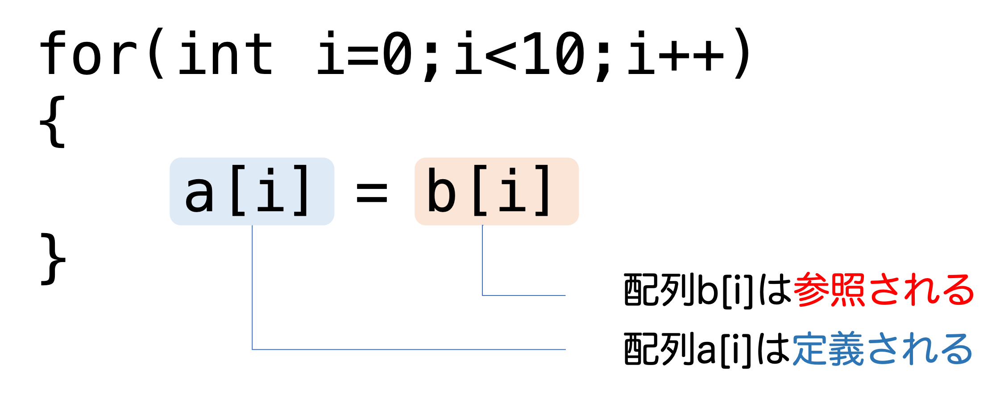
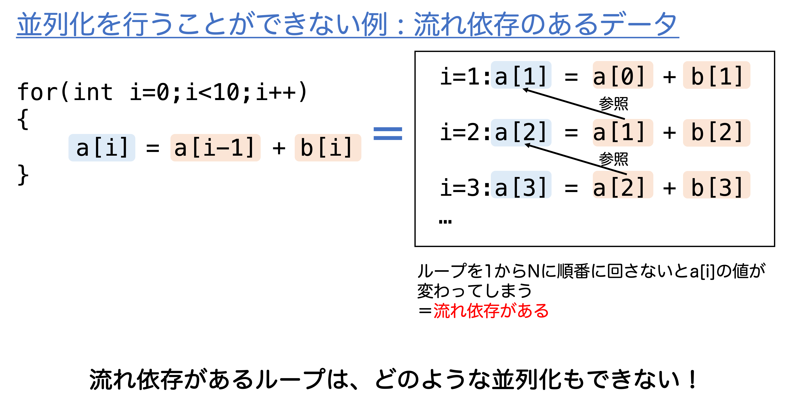
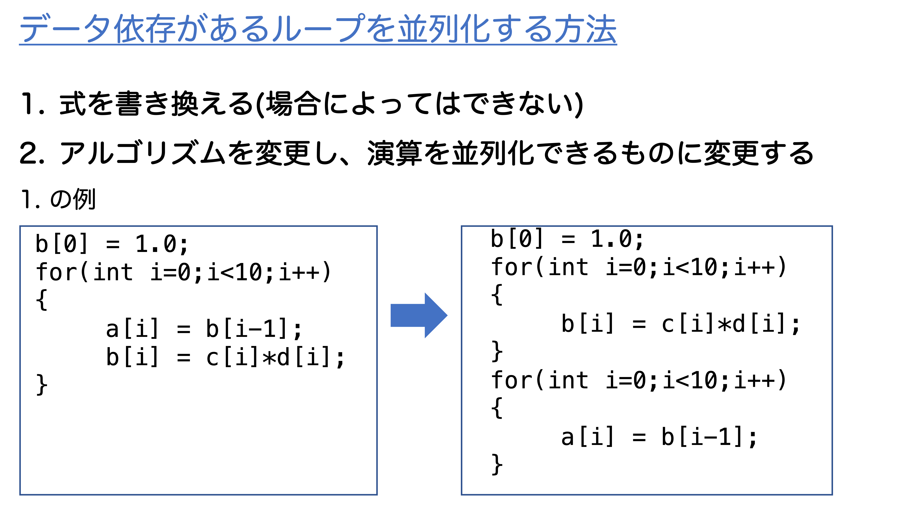

# 第一章

## MEMO
- 排他制御はなるべく避ける
- スレッド性能が出やすいプログラムは
    - 共有メモリ上の共有データへのデータの読み書きが少ない
    - スレッド内の演算(ローカルな演算)がほとんどである

    つまり、共有メモリへのアクセスはなるべく減らそう!
    
    といった特徴を持つプログラムである。
- 並列化の本質は計算に内在するデータ依存の概念を理解することである。
    - 「データ依存の概念」 = ループ中にどのようなデータの流れがあるか
    - 「データの流れ」 = データを定義する処理とテータを参照する処理との関係
    
        
    
    - 並列化できないループの例と対処方法

        
        
